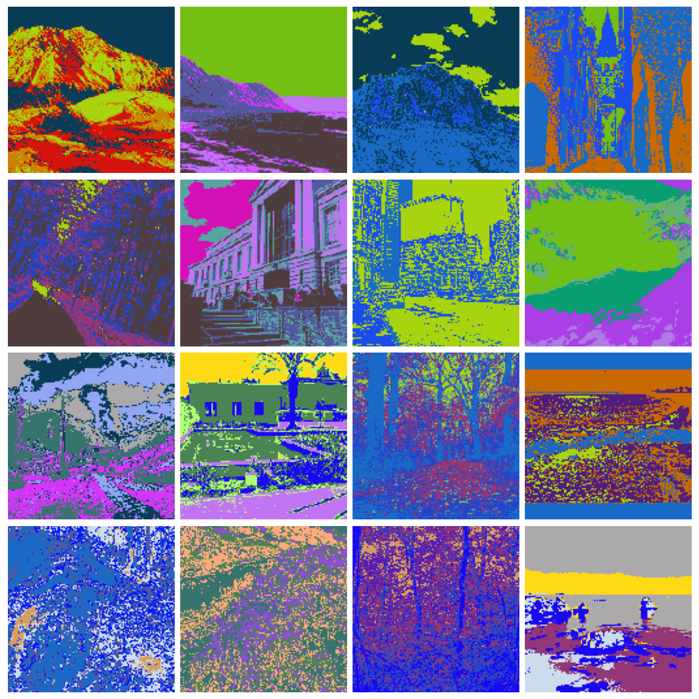
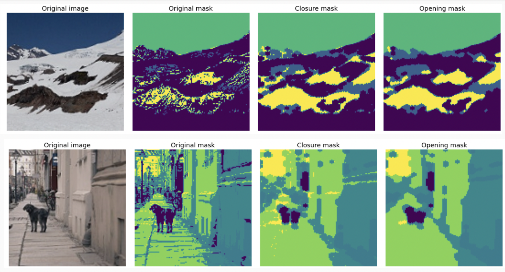
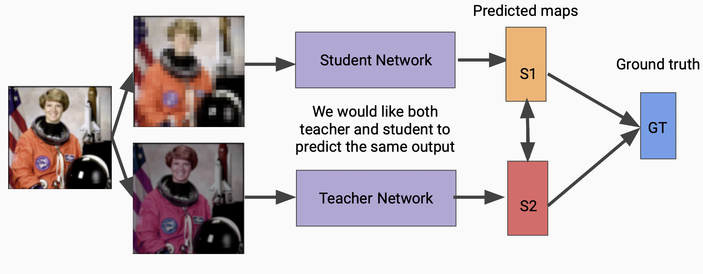
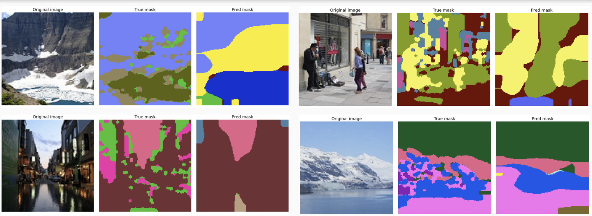
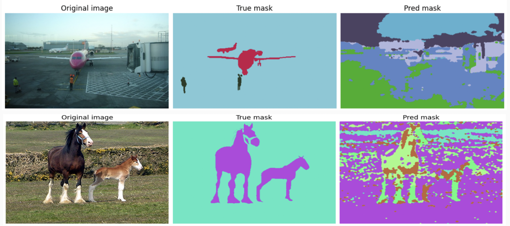

# Unsupervised-Guidance-For-Semantic-Segmentation
---
This is the Unsupervised Guidance For Semantic Segmentation. 

The aim of the project is to use the unsupervised segmentation as a prior of Neural Network model. 

## Example of kMeans Segmentation

This is an example of the kMeans mask on the [Intel Image Classification](https://www.kaggle.com/puneet6060/intel-image-classification) dataset with 40 clusters. 

## Smoothing masks by morphology

The initial noisy annotation can be smoothed with morphological operations. 

Use scripts `scripts/maskMorphology.sh` and `scripts/PascalVOCMaskProcessing.sh` for this. 

## Twin training

One can train the model not only to match the ground truth mask, but to match the teacher model prediction as well. 

The illustration of the method is depicted below:

Twin training is implemented in the `main_twins.py` script. 

## Results of NN training on kMeans Segmentation

## Pascal VOC ground masks vs kMeans

Pascal VOC ground annotations differ significantly from those predicted by kMeans. 

## Requirements and dependenicies

* `torch`, `torchvision`
* `opencv`
* `scikit-learn`
* `albumentations`
* `wandb` (optional, for logging)

Download and unpack [Intel Image Classification](https://www.kaggle.com/puneet6060/intel-image-classification) dataset. 

Download and unpack [Pascal VOC 2012](http://host.robots.ox.ac.uk/pascal/VOC/voc2012/index.html) dataset.

## Structure of the project

* `main.py` - training on `IIC` dataset
* `main_twins.py` - training on `IIC` dataset with contrastive loss with teacher
* `main_pascal_voc.py` - training on `Pascal VOC` dataset
* `scripts` - contains the scripts for kMeans segmentation and morphology
* `notebooks` - notebooks for the visualization of the results
* `src` - implementation of the core functionality.
